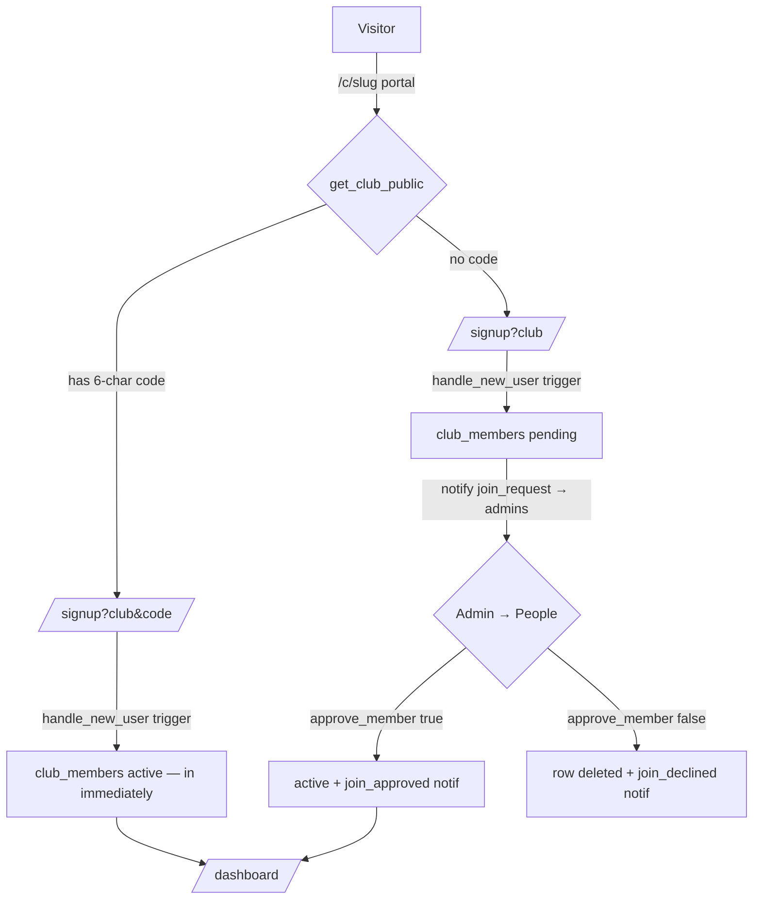
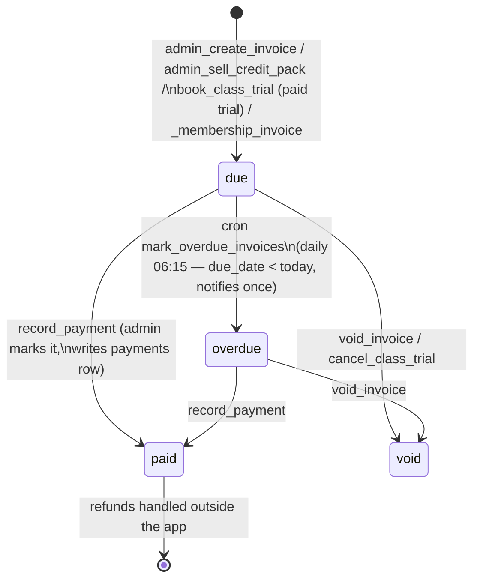

# Ignyte Club Manager — End-user connections, relationships & flows

Sources of truth: `supabase/schema.sql` (v4 multi-club schema), `supabase/migration-v5-club-manager.sql` (v5 — classes, invoices/payments, membership plans, class registers; **additive, not yet surfaced in the UI**), `src/lib/app.ts` (auth/club-context), `src/layouts/AppLayout.astro` (nav/drawer/notification bell), `src/worker.js` (the `/c/{slug}` rewrite), every page under `src/pages`, and `supabase/functions/send-notification-email` (email fan-out).

Anything marked **(v5)** exists in the database layer only — the RPC/table is live once the migration runs, but no page calls it yet.

---

## 1. Roles & identity model

One login (a Supabase `auth.users` row + `public.profiles` row) can wear a different hat at every club. There is **no global "coach" or "admin" account** — only `profiles.role = 'owner'` is meaningful platform-wide.

| Actor | Login? | Where the role lives | How they come to exist |
|---|---|---|---|
| **Anonymous visitor** | no | — | Browses `/`, `/about`, `/pricing`, `/contact`, `/c/{slug}` (public portal), `/invite?i=…` preview. Only two RPCs are granted to `anon`: `get_club_public` and `get_invite_public` (plus an anon `insert` policy on `club_leads`). |
| **Parent / guardian** | yes | `club_members.role = 'parent'` per club | `/signup` (default role). Owns child athlete records via `athletes.parent_id`. |
| **Adult athlete (18+)** | yes | `club_members.role = 'athlete'` per club | `/signup` with "Athlete 18+"; the `handle_new_user` trigger **rejects the signup if DOB < 18 years ago** and auto-creates their own `athletes` row with `profile_id = auth.uid()` (self-owned). |
| **Under-18 athlete** | **no** | — (not a member; an `athletes` row only) | Created by a parent on `/athletes` (`athletes.parent_id = parent`). Medical notes + media consent live on this single record and never diverge between clubs. |
| **Coach** | yes | `club_members.role = 'coach'` per club | **Invite-only** (`create_club_invite` → `/invite?i=…` → `accept_club_invite`). Public join paths can never mint coach/admin. A `coach_profiles` row is auto-created by the `members_coach_profile` trigger. |
| **Club admin** | yes | `club_members.role = 'admin'` per club | Provisions a club at `/start` (`provision_club` makes them admin), accepts an admin invite, or is promoted via `set_member_role`. |
| **Platform owner** | yes | `profiles.role = 'owner'` (guarded by the `profiles_role_guard` trigger — only an owner can change account-level roles) | Ops console at `/owner`. Sees every club; mutating inside a club requires a live `owner_support_grants` row (see §6). |

**Key identity relationships**

- **Login → per-club role:** `club_members (club_id, profile_id, role, status)` is the membership table; `member_role(club)`, `is_admin_of(club)`, `is_coach_of(club)` derive everything. `status` ∈ `active | pending | removed` — `pending` is a join request awaiting approval, `removed` keeps the account intact for other clubs.
- **One athlete, many clubs:** `athletes` holds ONE record per child (or one self-record per adult athlete); `athlete_enrolments (athlete_id, club_id)` is the many-to-many that enrols them per club. Bookings/classes always check `athlete_in_club(aid, club)`.
- **Athlete ownership:** `owns_athlete(aid)` = `athletes.parent_id = auth.uid()` **or** `athletes.profile_id = auth.uid()` — so parent flows and adult-athlete flows use the exact same RPCs.
- **Staff visibility of an athlete:** `staff_of_athlete(aid)` = coach/admin of any club the athlete is enrolled in (or owner).
- **Active club context (client side):** `requireAuth()` in `src/lib/app.ts` resolves the active club as `?club=` URL param → `localStorage['icm-active-club']` → `profiles.last_club_id` → sole membership. The drawer in `AppLayout.astro` shows a club switcher for multi-club users; switching purges the `ignyte-data*` caches so nothing bleeds between clubs. Nav links are role-filtered by `data-roles` (owner sees everything).

---

## 2. Entity relationship map

```mermaid
erDiagram
    clubs ||--o{ club_members : "membership (role per club)"
    clubs ||--|| club_settings : "policy, tz, payments cfg (v5 cols)"
    clubs ||--o{ locations : ""
    clubs ||--o{ club_invites : "staff invites"
    clubs ||--o{ skills : "club copy (club_id null = platform template)"
    clubs ||--o| owner_support_grants : "time-boxed owner access"
    clubs ||--o{ owner_audit : ""

    profiles ||--o{ club_members : ""
    profiles ||--o{ athletes : "parent_id (0..n children)"
    profiles ||--o| athletes : "profile_id (adult athlete self-record)"
    profiles ||--o{ notifications : ""
    profiles ||--o{ credit_ledger : "per club"
    clubs ||--o{ credit_ledger : ""
    clubs ||--o{ coach_profiles : ""
    profiles ||--o{ coach_profiles : "coach"

    athletes ||--o{ athlete_enrolments : ""
    clubs ||--o{ athlete_enrolments : ""

    clubs ||--o{ slots : "1-2-1 grid"
    locations ||--o{ slots : ""
    slots ||--o{ slot_coaches : "coach availability"
    profiles ||--o{ slot_coaches : "coach"
    slots ||--o{ bookings : ""
    athletes ||--o{ bookings : ""
    profiles ||--o{ bookings : "coach_id / booked_by"
    booking_series ||--o{ bookings : "weekly recurrence"
    clubs ||--o{ booking_series : ""
    slots ||--o{ waitlist : ""
    athletes ||--o{ waitlist : ""

    skills ||--o{ athlete_skills : ""
    athletes ||--o{ athlete_skills : ""
    athletes ||--o{ progress_notes : ""
    bookings ||--o{ progress_notes : "optional link"
    athletes ||--o{ skill_media : "needs media_consent"
    skills ||--o{ skill_media : "optional link"

    clubs ||--o{ broadcasts : ""
    clubs ||--o{ class_groups : "(v5) weekly group classes"
    class_groups ||--o{ class_enrolments : "(v5) enrolled|waiting|left"
    athletes ||--o{ class_enrolments : "(v5)"
    class_groups ||--o{ class_sessions : "(v5) dated instances"
    class_sessions ||--o{ class_attendance : "(v5)"
    class_sessions ||--o{ class_trials : "(v5)"
    athletes ||--o{ class_trials : "(v5)"

    clubs ||--o{ invoices : "(v5)"
    profiles ||--o{ invoices : "(v5) payer"
    invoices ||--o{ payments : "(v5)"
    clubs ||--o{ membership_plans : "(v5)"
    membership_plans ||--o{ memberships : "(v5)"
    athletes ||--o| memberships : "(v5) max 1 active per club"
    profiles ||--o{ memberships : "(v5) payer_id"
    invoices }o--o| memberships : "(v5) meta.membership_id"
```



Cardinality notes:

- `bookings` carries two partial unique indexes: one **booked** row per `(slot_id, coach_id)` and per `(slot_id, athlete_id)`. `waitlist` allows one active (`waiting|offered`) row per `(slot_id, athlete_id)`.
- `memberships` **(v5)**: unique active membership per `(club_id, athlete_id)`.
- `skills.club_id = null` is the owner-curated platform template, cloned into each club at `provision_club`.
- `notifications.club_id = null` = platform-level notice (announcements, join-declined, club-status).

---

## 3. Per-role flow walkthroughs

### 3.1 Visitor → member

1. Marketing: `/` (hero + features) → `/pricing` (Free vs Club £29/mo) → `/about` → `/contact` (inserts a `club_leads` row — the only anonymous DB write).
2. Club portal `/c/{slug}`: the Cloudflare worker (`src/worker.js`) rewrites `/c/{slug}` → `/club`, which calls `get_club_public(p_slug)` — name, blurb, coaches with disciplines/levels, locations, count of upcoming 1-2-1 slots, and **(v5)** the public class timetable. Applies the club's accent colour.
3. "Join {club}" card on the portal:
   - Not signed in → `/signup?club={slug}&code={code?}`. `supabase.auth.signUp` stashes `full_name, phone, role, dob, join_code, join_slug` in user metadata; the `handle_new_user` trigger creates the profile (+ self `athletes` row for 18+ athletes) and soft-attempts the join: **`join_code` ⇒ instant `club_members` row with `status='active'`; `join_slug` only ⇒ `status='pending'`** (failure never aborts signup).
   - Signed in → `join_by_code(p_code)` (instant, sets `last_club_id`) or `request_join(p_slug)` (pending + `join_request` notification to every club admin).
4. Alternative discovery: `/clubs` — `clubs_search(p_q)` over `searchable` active clubs, then the same code/request buttons; also the "Start your club" CTA → `/start`.
5. Pending members see "⏳ waiting for approval" on `/clubs`; an admin's `approve_member(club, profile, true)` flips them active and notifies `join_approved`; declining deletes the pending row and notifies `join_declined`.



### 3.2 Parent

All parent pages call `requireAuth(...)` and operate on the active club. Drawer: Dashboard, Book a lesson, My bookings, Athletes, Skill journey.

1. **Add athlete** — `/athletes` (roles `parent,admin`): direct `insert into athletes` (RLS `athletes_insert` requires `parent_id = auth.uid()`), immediately followed by `enrol_athlete(p_athlete, p_club)`. Medical notes + media-consent checkbox live here. Athletes enrolled at *other* clubs appear in a separate list with an "Enrol at {club}" button (same RPC) — this is the multi-club enrolment path. Removal: `unenrol_athlete` (blocked while upcoming bookings exist); if it was the athlete's only club the row itself is deleted.
2. **Book a 1-2-1** — `/book`: `get_slot_board(p_club, p_from, p_to)` renders tiles or a month calendar (`src/lib/calendar.ts`), filterable by date/location/coach/time-band. The booking panel picks athlete → discipline (`tumble | dance | both`; coaches filtered to those whose `coach_profiles.disciplines` cover it) → coach → **One-off / Weekly until cancelled** → `book_slot(p_slot_id, p_athlete_id, p_coach_id, p_weekly, p_discipline)`.
   - Server checks (in `book_slot` / `_create_booking`): club active, member active, athlete enrolled, coach in `slot_coaches`, capacity, coach-per-slot & athlete-per-slot uniqueness, and the coach's booking cut-off (`booking_notice_mins`, or `booking_notice_adjacent_mins` when the coach already has a lesson within 60 min at the same location — admins skip the cut-off).
   - Weekly: creates a `booking_series` row then loops `_create_booking` over every future slot of the `series_id`, skipping conflicts (returns `{booked, skipped}`).
   - **Credits spend:** on a one-off booking, if the payer's `credit_ledger` balance at the club is > 0, one credit is auto-debited (`'Lesson credit used'`, linked to the booking). Notifications: `booking_confirmed` → booker, `new_booking` → coach.
3. **Cancel** — `/bookings`: `cancel_booking(p_booking_id)`.
   - **On time** (outside `club_settings.cancellation_notice_hours`): status `cancelled`; any credit spent on it is returned (`'Credit returned — lesson cancelled'`).
   - **Late** (family-initiated inside the window, non-admin): status `late_cancelled` — *still payable* — and, if `late_cancel_makeup_tokens` is on, a +1 `'Makeup token — late cancellation'` credit plus a `credits` notification.
   - Either way the coach is notified (`booking_cancelled`) and `promote_waitlist(slot)` runs. Weekly: `cancel_booking_series` deactivates the series and cancels each future booking via the same RPC. The page also builds a client-side `.ics` download per lesson.
4. **Waitlist** — full slot on `/book` → `join_waitlist(p_slot_id, p_athlete_id, p_coach_id|null)`. When a space frees, `promote_waitlist` offers it FIFO (respecting a requested coach) with an `offer_expires_at = now() + waitlist_offer_hours` and a `waitlist_offer` notification. `/dashboard` and `/bookings` surface "A space has opened up!" — **Accept** = `accept_waitlist_offer(p_waitlist_id, p_coach_id?)` (for "any coach" entries the page re-reads `get_slot_board` to pick a free coach) → booking created, coach notified; **Pass** = `leave_waitlist` (re-promotes the next person). Expired offers are lapsed by the next `promote_waitlist` run.

```mermaid
sequenceDiagram
    participant Par as Parent (/bookings)
    participant DB as Postgres RPCs
    participant Next as Next family
    Par->>DB: cancel_booking(id)
    DB-->>Par: {late: true|false} (+makeup token if late)
    DB->>DB: promote_waitlist(slot) — FIFO, coach-aware
    DB-->>Next: notify 'waitlist_offer' (expires in offer_hours)
    Next->>DB: accept_waitlist_offer(waitlist_id, coach?)
    DB->>DB: _create_booking(skip notice)
    DB-->>Next: booked ✓  /  coach notified 'new_booking'
```

5. **Classes (v5)** — DB-ready, **no page yet**: `get_classes(p_club)` lists groups with enrolled/waiting counts and next date; `enrol_class(p_class, p_athlete)` enforces age band (`age_min..age_max`, admins may override) and capacity — full ⇒ `status='waiting'` (`class_waiting` notification) with auto-promotion on `leave_class` (`class_space` notification); `book_class_trial(p_class, p_athlete, p_session)` books a trial into a specific session (capacity counts enrolled + booked trials) and **auto-raises a trial invoice when `trial_price > 0`**; `cancel_class_trial` voids that invoice.
6. **Membership (v5)** — `start_membership(p_plan, p_athlete, p_payer?)`: payer defaults to the caller (owner of the athlete); first month's invoice raised immediately via `_membership_invoice`; `membership_started` notification. One active membership per athlete per club. `cancel_membership` ends it with the paid month.
7. **Receive & pay an invoice (v5)** — invoices arrive as `invoice_new` notifications pointing at "your Money page" (page not yet built; data readable via `invoices_select` RLS: own rows). Payment happens **outside the app** (club's `payment_link_url` / `payment_instructions`); the admin records it with `record_payment`, which fires `payment_received` and grants any `meta.grant_credits`.
8. **Watch the skill journey** — `/progress?athlete={id}`: per-discipline progress rings, level path, badge wall (mastered), coach `progress_notes`, and the 🎬 highlight reel — `skill_media` videos resolved through `supabase.storage.from('skill-media').createSignedUrl(path)` (private bucket). Milestones also arrive as `skill_milestone` notifications the moment a coach marks achieved/mastered.

### 3.3 Adult athlete (18+)

Identical journeys with one structural difference: their `athletes` row is self-owned (`profile_id = their uid`, no parent). `owns_athlete` therefore lets them book, cancel, waitlist, enrol, start memberships **(v5)** and view `/progress` for themselves. Their club role is `athlete`, so the drawer shows Dashboard / Book / Bookings / Skill journey (no `/athletes` page — that is parent/admin only). Broadcast audience `'parents'` includes them (`role in ('parent','athlete')`).

### 3.4 Coach

Joins by invite only (`/invite?i=…` → `accept_club_invite` → redirected to `/coach`). Drawer adds "📣 Coaching hub".

1. **Join slots** — `/coach` → "Join slots" tab: `get_slot_board` for the next 4 weeks + own `slot_coaches` rows; `coach_join_slot(p_slot_id, p_whole_series)` / `coach_leave_slot(...)` — leaving is blocked while they still have booked lessons in the slot/series. Being in `slot_coaches` is what makes them bookable by families.
2. **My settings** tab: upserts their own `coach_profiles` row (disciplines, levels, £ rate, and the two booking cut-offs used by `_create_booking`). RLS `coach_profiles_write` allows self-write for coach/admin of the club.
3. **Lesson registers** — "My lessons" tab (tiles or calendar, includes last week so overdue registers stay visible): `take_register(p_booking_id, 'present'|'absent')` for past lessons; `cancel_booking` for future ones (family gets `booking_cancelled` "by coach"). Medical notes surface as 🚑 pills straight off the `athletes` row.
4. **Class registers (v5)** — `get_class_register(p_session)` returns the session + roster (enrolled + trialists, each flagged `medical` and `trial`); `take_class_register(p_session, p_athlete, p_status)` upserts `class_attendance` and flips an attended trial's `class_trials.status` to `'attended'`. No coach-hub tab yet.
5. **Progression updates** — the "Progress" button on any lesson opens the editor: `update_athlete_skill(p_athlete_id, p_skill_id, p_status, p_notes?)` (coach-of-club only, athlete must be enrolled) — first transition into `achieved`/`mastered` fires the `skill_milestone` notification to the athlete's owner; `add_progress_note(p_club, p_athlete_id, p_note, p_booking_id)` adds a family-visible note.
6. **Skill videos** — upload to the `skill-media` storage bucket at path `${club.id}/${athleteId}/${uuid}-{file}` then `add_skill_media(p_club, p_athlete_id, p_path, p_skill_id?, p_note?)`. The RPC **refuses unless `athletes.media_consent`** is true and enforces the storage-path rule `position(club_id || '/' in path) = 1` (a club can only register media under its own prefix). Owner of the athlete gets `skill_media` ("🎬 New video added") unless they uploaded it themselves.
7. **Notifications they receive:** `new_booking` (one-off, weekly, waitlist-accept), `booking_cancelled` (family/admin cancels), `register_reminder` (hourly cron, once per booking, 1h after the lesson ends unregistered), `class_enrolled` / `trial_booked` **(v5, as lead coach)**, `broadcast` (audience `coaches`/`everyone`).

### 3.5 Club admin

`/admin` (roles `admin` — owner passes with a grant/`?club=`) is a nine-tab console; `/start` is the provisioning wizard.

1. **Provision** — `/start`: `provision_club(p_name, p_slug, p_timezone, p_disciplines, p_location)` creates the club, `club_settings`, the creator's admin membership, the first location, **clones the platform skill template**, sets `last_club_id`, logs `club_provisioned` to `owner_audit`, and returns the portal link + join code.
2. **Settings** tab: `update_club_settings` — cancellation notice hours, policy text, waitlist offer hours, makeup-token toggle. **(v5)** `update_payment_settings(p_club, p_currency, p_instructions, p_link, p_due_days)` adds currency symbol, payment instructions, `https://`-only pay link and default invoice due days — no UI tab yet.
3. **Locations** tab: direct table writes under `locations_admin_write` RLS (add/rename/disable).
4. **Slots** tab (interval engine): `admin_create_slots(p_club, p_date, p_start, p_capacity, p_weeks, p_end?, p_interval_mins, p_location, p_notes)` — with an end time it fills the window with back-to-back 30/60-min slots; `p_weeks > 1` repeats each weekly under a shared `series_id` (max 52). `admin_extend_series(p_series_id, p_weeks)` clones the last week forward, copies its `slot_coaches`, and re-books every **active** `booking_series` rider into the new weeks. `admin_delete_slot` cancels bookings (notify `booking_cancelled`) and notifies waitlisters (`slot_removed`). Per-slot "Manage" panel: cancel individual bookings, or manually add one via `book_slot` (admins bypass notice cut-offs and can book for any enrolled athlete).
5. **Classes (v5)** — `admin_save_class(...)` (create/update a `class_groups` row; validates location + lead coach belong to the club; future sessions follow day/time changes; always tops up 8 weeks of `class_sessions` via `ensure_class_sessions`), `admin_set_class_active(p_class, p_active)` (deactivating deletes future attendance-free sessions), `admin_cancel_class_session(p_session, p_cancelled)` (notifies every enrolled family `class_cancelled`). No tab yet.
6. **People** tab: pending approvals (`approve_member`), staff invites (`create_club_invite` → copies `/invite?i={uuid}` link; `revoke_club_invite`), role changes (`set_member_role`), removal (`remove_member`), inline coach-profile editor (direct `coach_profiles` upsert), and **credits**: `admin_adjust_credits(p_club, p_profile, p_delta, p_reason)` (±, notifies `credits`, returns new balance).
7. **Money (v5)** — all RPCs live, no tab yet: `admin_create_invoice` (manual invoice → `invoice_new` notification), `admin_sell_credit_pack(p_club, p_profile, p_credits, p_amount)` (an invoice with `meta.grant_credits`), `record_payment(p_invoice, p_method, p_reference?)` (marks paid, writes a `payments` row, grants `meta.grant_credits` to the ledger, notifies `payment_received`), `void_invoice` (unpaid only — "refunds are recorded outside the app"), `chase_invoice` (manual `invoice_reminder` nudge), `admin_money_summary(p_club)` (due/overdue/paid-30d, 6-month series, top-12 debtors), plans: `admin_save_plan(...)`, memberships: `start_membership` with explicit `p_payer`, `cancel_membership`.
8. **Messages** tab: `admin_broadcast(p_club, p_audience, p_title, p_body)` — audiences `everyone | parents (incl. athletes) | coaches`; fan-out is one `notifications` row per recipient; `broadcast_read_counts(p_club)` powers the "x/y read" pills.
9. **Export** tab: client-side `.xlsx` (SheetJS) — an Attendance sheet (every booking in range, late-cancels marked *payable*) and a Coach-pay sheet (payable lessons × `coach_profiles.rate_per_lesson`).
10. **Branding** tab: `update_club_branding` (name, blurb, searchable; **accent colour/logo rejected on the free plan**), portal-link copy, and `rotate_join_code` (old code dies instantly).

### 3.6 Platform owner

`/owner` (guarded by `requireOwner()` → `profiles.role === 'owner'`).

1. **Health board** — `owner_club_health()`: per-club families/coaches/pending counts, bookings-per-week (28-day avg), last booking, with a "quiet 3+ weeks" flag.
2. **Plan & status** — `owner_set_plan(p_club, 'free'|'club'|'comped')`; `owner_set_club_status(p_club, 'active'|'suspended'|'churned')` — non-active notifies the club's admins (`club_status`) and triggers the **full lock** (§6). Both audit to `owner_audit`.
3. **Support access** — "View as admin": OK = `owner_grant_support(p_club, 60)` (5–240 min, upserted into `owner_support_grants`, audited) then jump to `/admin?club={id}`; Cancel = read-only view (owner reads pass RLS everywhere, but every mutating RPC gate is `is_admin_of` = admin **or** `is_owner_with_grant`, so without a live grant writes fail). `requireAuth` has a dedicated branch letting an owner enter a club they're not a member of via `?club=`.
4. **Announcements** — `owner_announce(p_title, p_body)`: one `platform` notification (club_id null) per active-club admin.
5. **Leads** — `club_leads` from `/contact`; status walked `new → contacted → converted/closed` by direct update (owner-only RLS).
6. **Audit trail** — last 15 `owner_audit` rows; every admin-side RPC also calls `owner_log(...)` which only writes when the *caller* is the owner — i.e. the audit trail records what the owner did inside clubs, plus platform events.

---

## 4. Notification map

Every in-app notification is a `notifications` row written via `notify()` (or direct insert for broadcasts/announcements). The bell in `AppLayout.astro` shows the latest 20 and marks all read on open. A Database Webhook on INSERT optionally forwards each one as an email via the `send-notification-email` edge function (Resend; button links to `/bookings`).

| `type` | Triggered by | Recipient | Points at |
|---|---|---|---|
| `join_request` | `request_join` | every active admin of the club | Admin → People |
| `join_approved` | `approve_member(true)` | the requester | the club (dashboard) |
| `join_declined` | `approve_member(false)` (club_id **null**) | the requester | — |
| `booking_confirmed` | `book_slot` (one-off & weekly variants) | the booker | slot / series |
| `new_booking` | `book_slot`; `accept_waitlist_offer` | the coach | slot / series / booking |
| `booking_cancelled` | `cancel_booking` (by coach → family; by admin → family; any → coach, flagged "late — still payable"); `admin_delete_slot` → each booked family | family and/or coach | booking / slot |
| `slot_removed` | `admin_delete_slot` | each active waitlister's creator | slot |
| `waitlist_offer` | `promote_waitlist` (runs after every cancel/leave/expiry) | waitlist entry creator | `/bookings` ("respond within N hours") |
| `credits` | `cancel_booking` late-cancel makeup token; `admin_adjust_credits` | the payer | credit balance |
| `skill_milestone` | `update_athlete_skill` first move into achieved/mastered | athlete's owner (parent or self) | `/progress` (athlete, skill) |
| `skill_media` | `add_skill_media` (when uploader ≠ owner) | athlete's owner | `/progress` highlight reel |
| `broadcast` | `admin_broadcast` | each member in the audience | message itself (read-tracked) |
| `register_reminder` | cron `remind_missing_registers` (hourly :30; once per booking, ≥1h after lesson end) | the coach | the unregistered booking (`/coach`) |
| `rebook_nudge` | cron `send_rebook_nudges` (daily 10:00; ≥14 days idle, throttled to one per 14 days) | parent/athlete with no upcoming booking | `/book` |
| `club_status` | `owner_set_club_status` to suspended/churned (club_id **null**) | the club's admins | contact Ignyte |
| `platform` | `owner_announce` (club_id **null**) | every active club admin | — |
| `class_cancelled` **(v5)** | `admin_cancel_class_session` | owners of enrolled athletes | the session |
| `class_enrolled` **(v5)** | `enrol_class` (place confirmed) | enroller; lead coach ("New class member") | the class |
| `class_waiting` **(v5)** | `enrol_class` when full | enroller | class waiting list |
| `class_space` **(v5)** | `leave_class` auto-promotion | promoted athlete's owner | the class |
| `trial_booked` **(v5)** | `book_class_trial` | booker (+ invoice pointer if paid trial); lead coach | trial / Money page |
| `invoice_new` **(v5)** | `admin_create_invoice`; `_membership_invoice` | the payer | "your Money page" |
| `invoice_reminder` **(v5)** | `chase_invoice` (manual) | the payer | Money page |
| `invoice_overdue` **(v5)** | cron `mark_overdue_invoices` (daily 06:15, once — on flip to overdue) | the payer | Money page |
| `payment_received` **(v5)** | `record_payment` (+ credit-grant note) | the payer | invoice |
| `membership_started` **(v5)** | `start_membership` | the payer | membership + first invoice |
| `membership_cancelled` **(v5)** | `cancel_membership` | the payer | membership |

---

## 5. Money flows

**Design stance (v5 header + `/pricing`):** *the club is merchant of record; Ignyte never takes a cut and never touches card data.* All actual money movement happens outside the app — the club's `payment_link_url` (Stripe/PayPal/whatever, must be `https://`) or free-text `payment_instructions` (bank transfer details) from `club_settings`, plus cash/card in person. The app's job is the ledger.

**Invoice lifecycle (v5):**



- `invoices.source` ∈ `manual | membership | credit_pack | trial | lessons | class`; `invoice_no` is a sequential identity; `due_date` defaults to `current_date + club_settings.invoice_due_days` (paid trials: no later than the session date).
- `record_payment(p_invoice, p_method ∈ cash|bank_transfer|card|online|other, p_reference?)` marks the invoice paid, inserts a `payments` row, and — the credit hook — **grants `meta.grant_credits` lesson credits** to the payer's `credit_ledger` (used by credit packs and membership perks).

**What grants credits (`credit_ledger`, per club per profile):**

| Source | Delta | Reason string |
|---|---|---|
| `admin_adjust_credits` (Admin → People) | ± any | admin-supplied |
| Late cancellation with makeup tokens on | +1 | `Makeup token — late cancellation` |
| On-time cancellation of a credit-paid booking | +1 | `Credit returned — lesson cancelled` |
| `record_payment` of a credit-pack / membership invoice **(v5)** | +`meta.grant_credits` | `Included with: {invoice description}` |
| One-off `book_slot` with a positive balance | −1 | `Lesson credit used` |

**Membership billing cycle (v5):** `start_membership` raises month one immediately; the cron `generate_membership_invoices` (06:00 on the **1st**) loops every active membership in every active club through `_membership_invoice(current_date)` — idempotent per `(membership, period_start)`, skips voids, description `"{Plan} — {Athlete} (Month YYYY)"`, `period_start/period_end` set to the calendar month, and `grant_credits` attached when the plan includes `private_credits_per_month`. `mark_overdue_invoices` chases daily; `cancel_membership` stops future invoices ("ends with the current paid month"). Plans (`membership_plans`) carry `monthly_fee`, `classes_per_week` (null = unlimited) and `private_credits_per_month`.

**Cron summary:** v4 — `ignyte-register-reminders` (`30 * * * *`), `ignyte-rebook-nudges` (`0 10 * * *`); v5 — `ignyte-membership-invoices` (`0 6 1 * *`), `ignyte-overdue-invoices` (`15 6 * * *`), `ignyte-class-sessions` (`0 3 * * 1`, rolls 8 weeks of `class_sessions` forward). All service-role-only.

**Coach pay** stays a v4 flow: Admin → Export builds the per-coach pay sheet (payable = `booked` + `late_cancelled`, × `rate_per_lesson`); paying coaches also happens outside the app.

---

## 6. Isolation & security relationships

**Layer 1 — RLS on every table** (all tables have RLS enabled; the anon key can reach only `get_club_public`, `get_invite_public` and `club_leads` insert).

- `my_club_ids()` is the tenant wall: the set of clubs the caller may *see* — for the owner it is *all* clubs; for everyone else only clubs where they hold an **active** membership **and the club itself is `active`**. Every club-scoped select policy (`slots`, `bookings`, `waitlist`, `club_settings`, `locations`, `coach_profiles`, `progress_notes`, `skill_media`, `credit_ledger`, and all v5 tables) starts with `club_id in (select my_club_ids())`, then narrows further (own rows / own athletes / staff / admin).
- **Suspended-club full lock** falls straight out of that definition: `owner_set_club_status(club,'suspended')` makes the club vanish from `my_club_ids()` for every member in one move — every club-scoped read returns nothing, and every mutating RPC calls `assert_club_active(club)` ("This club is currently unavailable."). `clubs_select` deliberately still lets members read the `clubs` row itself (any membership status) so the UI can show name + "currently unavailable" (`/clubs` grays it out; `requireAuth` filters it from usable memberships). Cron jobs likewise join `clubs ... status='active'` so a locked club gets no reminders, invoices or nudges. The owner retains full visibility throughout.
- Cross-club leak prevention on shared entities: `profiles_select` only exposes people who share a club with you *and* one side is staff; athletes are visible to family (`owns_athlete`) or staff of an enrolled club (`staff_of_athlete`); `athlete_skills`/`athletes` are the only rows that intentionally travel with the child between clubs — everything operational (`bookings`, `progress_notes`, `skill_media`, `credit_ledger`, invoices) is club-fenced.

**Layer 2 — every write flows through SECURITY DEFINER RPCs.** `revoke execute on all functions ... from public, anon, authenticated` then explicit grants; each RPC re-checks role (`is_admin_of` / `is_coach_of` / `owns_athlete`), club-activity, enrolment (`athlete_in_club`) and business rules server-side, so the client JS is never trusted. Internal helpers (`_create_booking`, `_membership_invoice`, cron functions) are granted to `service_role` only.

**Layer 3 — client context hygiene.** `requireAuth` resolves an explicit active club, stores it, applies branding, and role-gates each page (`['admin']`, `['coach','admin']`, `['parent','admin']`, `'any'`); switching clubs purges the `ignyte-data*` PWA caches.

**Owner grant mechanics.** `is_owner()` alone only unlocks *reads* and the owner-console RPCs. Mutations inside a club route through `is_admin_of(club)` / `is_coach_of(club)`, which are true for the owner **only while `owner_support_grants.expires_at > now()`** for that club (`is_owner_with_grant`). Grants are per-club, single-row (upsert), clamped to 5–240 minutes by `owner_grant_support`, audited on creation, and every subsequent owner action inside the club is also captured by `owner_log` into `owner_audit`. `/owner`'s "View as admin" makes the choice explicit: grant-then-enter, or enter read-only. Account-level role escalation is closed off separately by the `profiles_role_guard` trigger (only an owner can change `profiles.role`) and by `create_club_invite` refusing non-staff roles — so `parent → coach/admin` can only ever happen via an admin's invite or `set_member_role`.
